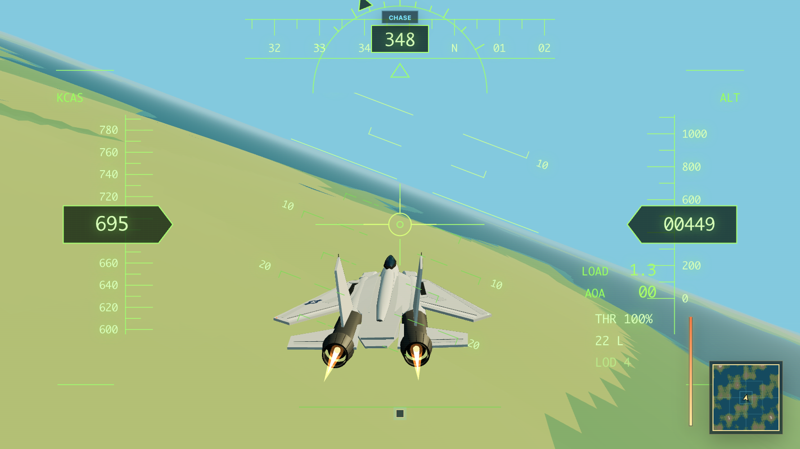

# LCR Retro Flight Sim



*Rear follow-camera view from the current Three.js build with the in-game HUD active.*

This development demo was built with [Little Control Room](https://github.com/dpasca/LittleControlRoom), using GPT-5.5 and GPT-5.6-Sol.

A compact browser flight sandbox built with TypeScript, Three.js, and Vite. It combines a detailed procedural variable-sweep aircraft, lightweight flight dynamics, an effectively endless low-poly world, and a modern SVG head-up display.

This is an independent technical and visual prototype. It is not affiliated with or endorsed by any aircraft manufacturer, defense contractor, or government agency.

## Highlights

- Detailed procedural twin-engine aircraft with variable wing sweep, control surfaces, lights, stores, and afterburners
- Quaternion-based flight motion with speed-dependent control authority, bank-to-turn coupling, and basic load/AOA feedback
- Four nested terrain LOD bands with water, fog, shadows, horizon markers, and seamless world wrapping
- Playable chase camera plus a close orbit view for inspecting the aircraft
- Scalable SVG HUD with pitch ladder, speed/altitude/heading tapes, control feedback, and terrain minimap
- Desktop-first browser build with responsive HUD sizing for narrower displays

## Run locally

Requirements: Node.js 20.19 or newer and pnpm 9.7.

```sh
corepack enable
pnpm install
pnpm dev
```

Open [http://127.0.0.1:5173](http://127.0.0.1:5173). To create and preview a production build:

```sh
pnpm build
pnpm preview
```

## Controls

| Input | Action |
| --- | --- |
| `W` / up arrow | Push the nose down |
| `S` / down arrow | Pull the nose up |
| `A` / `D` or left/right arrows | Roll left/right |
| `Q` / `E` | Yaw left/right |
| `Shift` / `Control` | Increase/decrease throttle |
| Drag the flight view | Pitch and roll |
| Mouse wheel | Adjust throttle |
| `V` | Toggle chase/orbit view |
| Drag in orbit view | Rotate around the aircraft |
| Mouse wheel in orbit view | Zoom |

The current interaction model is desktop-first. The layout scales down for mobile-sized screens, but touch ergonomics and mobile performance are not yet release-verified.
